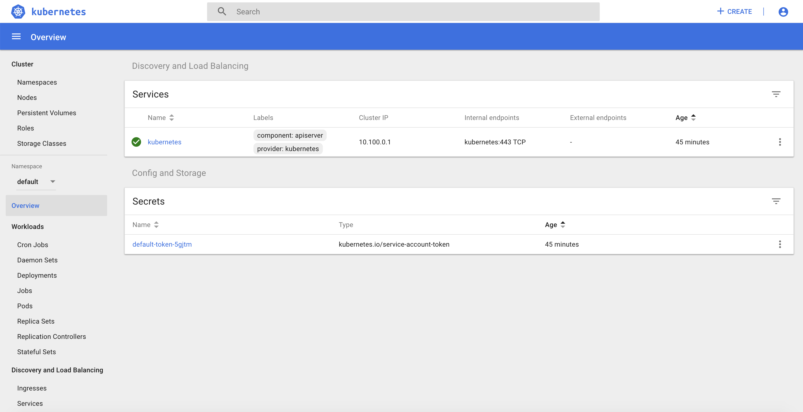
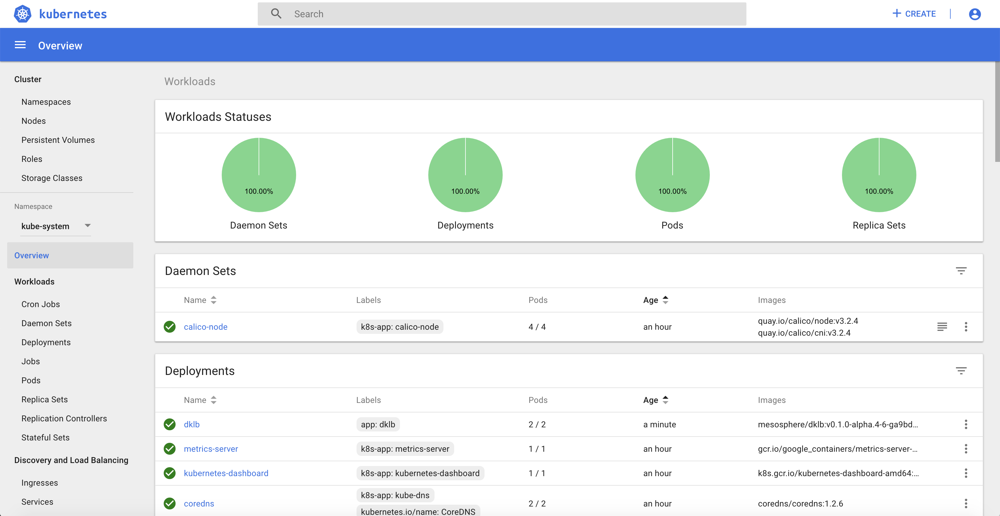

# Mesosphere DC/OS Kubernetes training

## Introduction

During this training, you'll learn how to use the main capabilities of Kubernetes on DC/OS:

- Deploy a Kubernetes cluster
- Scale a Kubernetes cluster
- Upgrade a Kubernetes cluster
- Expose a Kubernetes Application using a Service Type Load Balancer (L4)
- Expose a Kubernetes Application using an Ingress (L7)
- Leverage persistent storage using Portworx
- Leverage persistent storage using CSI
- Configure Helm
- Deploy Istio using Helm
- Deploy an application on Istio

During the labs, replace X by the number assigned by the instructor (starting with 00).

## Pre requisites

You need to have access to a DC/OS Enteprise Edition cluster deployed in strict mode with 1.12.1 or later.

The DC/OS Kubernetes MKE package must be installed in the cluster. This package is used by DC/OS to manage multiple DC/OS clusters on the same DC/OS cluster.

The DC/OS EdgeLB package must be installed in the cluster. This package is used by DC/OS to expose the Kubernetes API server, the Portworx UI and the Kubernetes apps to the outside world.

Portworx must be deployed on the DC/OS cluster.

Run the following command to export the environment variables needed during the labs:

```
export APPNAME=training
export PUBLICIP=<IP provided by the instructor>
export CLUSTER=<the number assigned by the instructor: 00, 01, ..>
```

Log into the DC/OS Kubernetes cluster with the information provided by your instructor and download the DC/OS CLI.

Run the following command to setup the DC/OS CLI:

```
dcos cluster setup https://<IP provided by the instructor>
```

Run the following command to add the DC/OS Enterprise extensions to the DC/OS CLI:

```
dcos package install --yes --cli dcos-enterprise-cli
```

Install the kubectl CLI using the instructions available at the URL below:

[https://kubernetes.io/docs/tasks/tools/install-kubectl/#install-kubectl](https://kubernetes.io/docs/tasks/tools/install-kubectl/#install-kubectl)

Add the following line to your /etc/hosts (or c:\Windows\System32\Drivers\etc\hosts) file:

```
<PUBLICIP variable> training.prod.k8s.cluster<CLUSTER variable>.mesos.lab
```

## 1. Deploy a Kubernetes cluster

Create a file called options-kubernetes-cluster${CLUSTER}.json using the following command:

```
cat <<EOF > options-kubernetes-cluster${CLUSTER}.json
{
  "service": {
    "name": "training/prod/k8s/cluster${CLUSTER}",
    "service_account": "training-prod-k8s-cluster${CLUSTER}",
    "service_account_secret": "/training/prod/k8s/cluster${CLUSTER}/private-training-prod-k8s-cluster${CLUSTER}"
  },
  "kubernetes": {
    "authorization_mode": "RBAC",
    "high_availability": false,
    "private_node_count": 2,
    "private_reserved_resources": {
      "kube_mem": 4096
    }
  }
}
EOF
```

It will allow you to deploy a Kubernetes cluster with RBAC enabled, HA disabled (to limit the resource needed) and with 2 private nodes.

Create a file called deploy-kubernetes-cluster.sh with the following content:

```
path=${APPNAME}/prod/k8s/cluster${1}
serviceaccount=${APPNAME}-prod-k8s-cluster${1}
underscore=${APPNAME}__prod__k8s__cluster${1}

dcos security org service-accounts keypair private-${serviceaccount}.pem public-${serviceaccount}.pem
dcos security org service-accounts delete ${serviceaccount}
dcos security org service-accounts create -p public-${serviceaccount}.pem -d /${path} ${serviceaccount}
dcos security secrets delete /${path}/private-${serviceaccount}
dcos security secrets create-sa-secret --strict private-${serviceaccount}.pem ${serviceaccount} /${path}/private-${serviceaccount}

dcos security org users grant ${serviceaccount} dcos:mesos:master:framework:role:cluster${1}-role create
dcos security org users grant ${serviceaccount} dcos:mesos:master:framework:role:${underscore}-role create
dcos security org users grant ${serviceaccount} dcos:mesos:master:task:user:root create
dcos security org users grant ${serviceaccount} dcos:mesos:agent:task:user:root create
dcos security org users grant ${serviceaccount} dcos:mesos:master:reservation:role:${underscore}-role create
dcos security org users grant ${serviceaccount} dcos:mesos:master:reservation:principal:${serviceaccount} delete
dcos security org users grant ${serviceaccount} dcos:mesos:master:volume:role:${underscore}-role create
dcos security org users grant ${serviceaccount} dcos:mesos:master:volume:principal:${serviceaccount} delete
dcos security org users grant ${serviceaccount} dcos:secrets:default:/${path}/* full
dcos security org users grant ${serviceaccount} dcos:secrets:list:default:/${path} read
dcos security org users grant ${serviceaccount} dcos:secrets:default:/${underscore}/* full
dcos security org users grant ${serviceaccount} dcos:secrets:list:default:/${underscore} read
dcos security org users grant ${serviceaccount} dcos:adminrouter:ops:ca:rw full
dcos security org users grant ${serviceaccount} dcos:adminrouter:ops:ca:ro full
dcos security org users grant ${serviceaccount} dcos:mesos:master:framework:role:slave_public/${underscore}-role create
dcos security org users grant ${serviceaccount} dcos:mesos:master:framework:role:slave_public/${underscore}-role read

dcos security org users grant ${serviceaccount} dcos:mesos:master:reservation:role:slave_public/${underscore}-role create
dcos security org users grant ${serviceaccount} dcos:mesos:master:reservation:role:slave_public/cluster${1}-role create


dcos security org users grant ${serviceaccount} dcos:mesos:master:volume:role:slave_public/${underscore}-role create
dcos security org users grant ${serviceaccount} dcos:mesos:master:framework:role:slave_public read
dcos security org users grant ${serviceaccount} dcos:mesos:agent:framework:role:slave_public read

dcos kubernetes cluster create --yes --options=options-kubernetes-cluster${1}.json --package-version=2.0.0-1.12.1
```

It will allow you to create the DC/OS service account with the right permissions and to deploy a Kubernetes cluster with the version 1.12.1.

Deploy your Kubernetes cluster using the following command:

```
chmod deploy-kubernetes-cluster.sh
./deploy-kubernetes-cluster.sh ${CLUSTER}
```

Configure the Kubernetes CLI using the following command:

```
dcos kubernetes cluster kubeconfig --context-name=${APPNAME}-prod-k8s-cluster${CLUSTER} --cluster-name=${APPNAME}/prod/k8s/cluster${CLUSTER} \
    --apiserver-url https://${APPNAME}.prod.k8s.cluster${CLUSTER}.mesos.lab:8443 \
    --insecure-skip-tls-verify
```

Run the following command to check that everything is working properly:

```
kubectl get nodes
NAME                                                           STATUS   ROLES    AGE   VERSION
kube-control-plane-0-instance.trainingprodk8scluster${CLUSTER}.mesos   Ready    master   23m   v1.12.1
kube-node-0-kubelet.trainingprodk8scluster${CLUSTER}.mesos             Ready    <none>   21m   v1.12.1
kube-node-1-kubelet.trainingprodk8scluster${CLUSTER}.mesos             Ready    <none>   21m   v1.12.1
```

Copy the Kubernetes config file in your current directory

```
cp ~/.kube/config .
```

Run the following command **in a different shell** to run a proxy that will allow you to access the Kubernetes Dashboard:

```
kubectl proxy
```

Open the following page in your web browser:

[http://127.0.0.1:8001/api/v1/namespaces/kube-system/services/https:kubernetes-dashboard:/proxy/](http://127.0.0.1:8001/api/v1/namespaces/kube-system/services/https:kubernetes-dashboard:/proxy/)

Login using the config file.



## 2. Scale your Kubernetes cluster

Run the following command to scale your Kubernetes cluster:

Edit the options-kubernetes-cluster${CLUSTER}.json file to set the private_node_count to 3.


Run the following command to update your cluster:

```
dcos kubernetes cluster update --cluster-name=training/prod/k8s/cluster${CLUSTER} --options=options-kubernetes-cluster${CLUSTER}.json --yes
Using Kubernetes cluster: training/prod/k8s/cluster1
2019/01/26 14:40:51 starting update process...
2019/01/26 14:40:58 waiting for update to finish...
2019/01/26 14:42:10 update complete!
```

You can check that the new node is shown in the Kubernetes Dashboard:


## 3. Upgrade your Kubernetes cluster

Run the following command to upgrade your Kubernetes cluster:

Run the following command to upgrade your cluster:

```
dcos kubernetes cluster update --cluster-name=training/prod/k8s/cluster${CLUSTER} --package-version=stub-universe --yes

```

You can check that the cluster has been updated using the Kubernete CLI:

```
kubectl get nodes
NAME                                                          STATUS   ROLES    AGE   VERSION
kube-control-plane-0-instance.trainingprodk8scluster${CLUSTER}.mesos   Ready    master   94m   v1.13.2-1+3ac0971ac54945
kube-node-0-kubelet.trainingprodk8scluster${CLUSTER}.mesos             Ready    <none>   92m   v1.13.2-1+3ac0971ac54945
kube-node-1-kubelet.trainingprodk8scluster${CLUSTER}.mesos             Ready    <none>   92m   v1.13.2-1+3ac0971ac54945
kube-node-2-kubelet.trainingprodk8scluster${CLUSTER}.mesos             Ready    <none>   36m   v1.13.2-1+3ac0971ac54945
```

## 4. Expose a Kubernetes Application using a Service Type Load Balancer (L4)

This feature leverage the DC/OS EdgeLB and a new service called dklb.

To be able to use dklb, you need to deploy it in your Kubernetes cluster using the following commands:

```
kubectl create -f dklb-prereqs.yaml
kubectl create -f dklb-deployment.yaml
```

You can use the Kubernetes Dashboard to check that the deployment dklb is running in the kube-system namespace:



You can now deploy a redis Pod on your Kubernetes cluster running the following command:

```
cat <<EOF | kubectl create -f -
apiVersion: v1
kind: Pod
metadata:
  labels:
    app: redis
  name: redis
spec:
  containers:
  - name: redis
    image: redis:5.0.3
    ports:
    - name: redis
      containerPort: 6379
      protocol: TCP
EOF
```

Finally, to expose the service, you need to run the following command to create a Service Type Load Balancer:

```
cat <<EOF | kubectl create -f -
apiVersion: v1
kind: Service
metadata:
  annotations:
    kubernetes.dcos.io/edgelb-pool-name: "dklb"
    kubernetes.dcos.io/edgelb-pool-size: "2"
    kubernetes.dcos.io/edgelb-pool-portmap.6379: "80${CLUSTER}"
  labels:
    app: redis
  name: redis
spec:
  type: LoadBalancer
  selector:
    app: redis
  ports:
  - protocol: TCP
    port: 6379
    targetPort: 6379
EOF
```

A dklb EdgeLB pool is automatically created on DC/OS:

You can validate that you can access the redis POD from your laptop using telnet:

```
telnet ${PUBLICIP} 80${CLUSTER}
Trying 34.227.199.197...
Connected to ec2-34-227-199-197.compute-1.amazonaws.com.
Escape character is '^]'.
```

## 5. Expose a Kubernetes Application using an Ingress (L7)

This feature leverage the DC/OS EdgeLB and the dklb service that has been deployed in the previous section.

You can now deploy 2 web application Pods on your Kubernetes cluster running the following command:

```
kubectl run --restart=Never --image hashicorp/http-echo --labels app=http-echo-1,owner=dklb --port 80 http-echo-1 -- -listen=:80 --text='Hello from http-echo-1!'
kubectl run --restart=Never --image hashicorp/http-echo --labels app=http-echo-2,owner=dklb --port 80 http-echo-2 -- -listen=:80 --text='Hello from http-echo-2!'
```

Then, expose the Pods with a Service Type NodePort using the following commands:

```
kubectl expose pod http-echo-1 --port 80 --target-port 80 --type NodePort --name "http-echo-1"
kubectl expose pod http-echo-2 --port 80 --target-port 80 --type NodePort --name "http-echo-2"
```

Finally create the Ingress to expose the application to the ourside world using the following command:

```
cat <<EOF | kubectl create -f -
apiVersion: extensions/v1beta1
kind: Ingress
metadata:
  annotations:
    kubernetes.io/ingress.class: edgelb
    kubernetes.dcos.io/edgelb-pool-name: "dklb"
    kubernetes.dcos.io/edgelb-pool-size: "2"
    kubernetes.dcos.io/edgelb-pool-port: "90${CLUSTER}"
  labels:
    owner: dklb
  name: dklb-echo
spec:
  rules:
  - host: "http-echo-${CLUSTER}-1.com"
    http:
      paths:
      - backend:
          serviceName: http-echo-1
          servicePort: 80
  - host: "http-echo-${CLUSTER}-2.com"
    http:
      paths:
      - backend:
          serviceName: http-echo-2
          servicePort: 80
EOF
```

The dklb EdgeLB pool is automatically updated on DC/OS:

You can validate that you can access the web application PODs from your laptop using the following commands:

```
curl -H "Host: http-echo-${CLUSTER}-1.com" http://${PUBLIC}:90${CLUSTER}
curl -H "Host: http-echo-${CLUSTER}-2.com" http://${PUBLIC}:90${CLUSTER}
```

## 6. Leverage persistent storage using Portworx

Portworx is a Software Defined Software that can use the local storage of the DC/OS nodes to provide High Available persistent storage to both Kubernetes pods and DC/OS services.

To be able to use Portworx persistent storage on your Kubernetes cluster, you need to deploy it in your Kubernetes cluster using the following commands:

```
version=$(kubectl version --short | awk -Fv '/Server Version: / {print $3}')
kubectl apply -f "https://install.portworx.com/2.0?kbver=1.12.3&b=true&dcos=true&stork=true"
```

Create the Kubernetes StorageClass using the following command:

```
cat <<EOF | kubectl create -f -
kind: StorageClass
apiVersion: storage.k8s.io/v1beta1
metadata:
   name: portworx-sc
provisioner: kubernetes.io/portworx-volume
parameters:
  repl: "2"
EOF
```

It will create volumes on Portworx with 2 replicas.

Run the following command to define this StorageClass as the default Storage Class in your Kubernetes cluster:

```
kubectl patch storageclass portworx-sc -p '{"metadata": {"annotations":{"storageclass.kubernetes.io/is-default-class":"true"}}}'
```

Create the Kubernetes PersistentVolumeClaim using the following command:

```
cat <<EOF | kubectl create -f -
kind: PersistentVolumeClaim
apiVersion: v1
metadata:
  name: pvc001
  annotations:
    volume.beta.kubernetes.io/storage-class: portworx-sc
spec:
  accessModes:
    - ReadWriteOnce
  resources:
    requests:
      storage: 1Gi
EOF
```

Check the status of the PersistentVolumeClaim using the following command:

```
kubectl describe pvc pvc001
Name:          pvc001
Namespace:     default
StorageClass:  portworx-sc
Status:        Bound
Volume:        pvc-82a8c601-2183-11e9-8f3c-3efe47e3184c
Labels:        <none>
Annotations:   pv.kubernetes.io/bind-completed: yes
               pv.kubernetes.io/bound-by-controller: yes
               volume.beta.kubernetes.io/storage-class: portworx-sc
               volume.beta.kubernetes.io/storage-provisioner: kubernetes.io/portworx-volume
Finalizers:    [kubernetes.io/pvc-protection]
Capacity:      1Gi
Access Modes:  RWO
VolumeMode:    Filesystem
Events:
  Type       Reason                 Age   From                         Message
  ----       ------                 ----  ----                         -------
  Normal     ProvisioningSucceeded  5s    persistentvolume-controller  Successfully provisioned volume pvc-82a8c601-2183-11e9-8f3c-3efe47e3184c using kubernetes.io/portworx-volume
Mounted By:  <none>
```

Create a Kubernetes Pod that will use this PersistentVolumeClaim using the following command:

```
cat <<EOF | kubectl create -f -
apiVersion: v1
kind: Pod
metadata:
  name: pvpod
spec:
  containers:
  - name: test-container
    image: alpine:latest
    command: [ "/bin/sh" ]
    args: [ "-c", "while true; do sleep 60;done" ]
    volumeMounts:
    - name: test-volume
      mountPath: /test-portworx-volume
  volumes:
  - name: test-volume
    persistentVolumeClaim:
      claimName: pvc001
EOF
```

Create a file in the Volume using the following commands:

```
kubectl exec -i pvpod -- /bin/sh -c "echo test > /test-portworx-volume/test"
```

Delete the Pod using the following command:

```
kubectl delete pod pvpod
```

Create a Kubernetes Pod that will use the same PersistentVolumeClaim using the following command:

```
cat <<EOF | kubectl create -f -
apiVersion: v1
kind: Pod
metadata:
  name: pvpod
spec:
  containers:
  - name: test-container
    image: alpine:latest
    command: [ "/bin/sh" ]
    args: [ "-c", "while true; do sleep 60;done" ]
    volumeMounts:
    - name: test-volume
      mountPath: /test-portworx-volume
  volumes:
  - name: test-volume
    persistentVolumeClaim:
      claimName: pvc001
EOF
```

Validate that the file created in the previous Pod is still available:

```
kubectl exec -i pvpod cat /test-portworx-volume/test
```

## 7. Leverage persistent storage using CSI

Unzip the archive containing the CSI driver for AWS:

```
unzip csi-driver-deployments-master.zip
```

Deploy the Kubernetes manifests in your cluster using the following command:

```
kubectl apply -f csi-driver-deployments-master/aws-ebs/kubernetes/latest/
```

Create the Kubernetes StorageClass using the following command:

```
cat <<EOF | kubectl create -f -
kind: StorageClass
apiVersion: storage.k8s.io/v1
metadata:
  name: ebs-gp2
  annotations:
    storageclass.kubernetes.io/is-default-class: "true"
provisioner: ebs.csi.aws.com
volumeBindingMode: WaitForFirstConsumer
parameters:
  type: gp2
  fsType: ext4
  encrypted: "false"
EOF
```

This time we define the Storage Class as the default one while we create it.

Create the Kubernetes PersistentVolumeClaim using the following command:

```
cat <<EOF | kubectl create -f -
apiVersion: v1
kind: PersistentVolumeClaim
metadata:
  name: dynamic
spec:
  accessModes:
    - ReadWriteOnce
  storageClassName: ebs-gp2
  resources:
    requests:
      storage: 1Gi
EOF
```

Create a Kubernetes Deployment that will use this PersistentVolumeClaim using the following command:

```
cat <<EOF | kubectl create -f -
apiVersion: apps/v1
kind: Deployment
metadata:
  name: ebs-dynamic-app
  labels:
    app: ebs-dynamic-app
spec:
  replicas: 1
  selector:
    matchLabels:
      app: ebs-dynamic-app
  template:
    metadata:
      labels:
        app: ebs-dynamic-app
    spec:
      containers:
      - name: ebs-dynamic-app
        image: centos:7
        command: ["/bin/sh"]
        args: ["-c", "while true; do echo $(date -u) >> /data/out.txt; sleep 5; done"]
        volumeMounts:
        - name: persistent-storage
          mountPath: /data
      volumes:
      - name: persistent-storage
        persistentVolumeClaim:
          claimName: dynamic
EOF
```

Check the content of the file /data/out.txt and note the first timestamp:

```
pod=$(kubectl get pods | grep ebs-dynamic-app | awk '{ print $1 }')
kubectl exec -i $pod cat /data/out.txt
```

Delete the Pod using the following command:

```
kubectl delete pod $pod
```

The Deployment will recreate the pod automatically.

Check the content of the file /data/out.txt and verify that the first timestamp is the same as the one noted previously:

```
pod=$(kubectl get pods | grep ebs-dynamic-app | awk '{ print $1 }')
kubectl exec -i $pod cat /data/out.txt
```

## 8. Configure Helm

Helm is a package manager for Kubernetes. Helm Charts helps you define, install, and upgrade even the most complex Kubernetes application.

Intall Helm on your laptop using the instructions available at the URL below:

[https://docs.helm.sh/using_helm/#installing-helm](https://docs.helm.sh/using_helm/#installing-helm)

Tiller is the in-cluster component of Helm. It interacts directly with the Kubernetes API server to install, upgrade, query, and remove Kubernetes resources. It also stores the objects that represent releases.

Run the following command to create a Kubernetes ServiceAccount for the Helm Tiller:

```
cat <<EOF | kubectl create -f -
apiVersion: v1
kind: ServiceAccount
metadata:
  name: tiller
  namespace: kube-system
---
apiVersion: rbac.authorization.k8s.io/v1beta1
kind: ClusterRoleBinding
metadata:
  name: tiller
roleRef:
  apiGroup: rbac.authorization.k8s.io
  kind: ClusterRole
  name: cluster-admin
subjects:
- kind: ServiceAccount
  name: tiller
  namespace: kube-system
EOF
```

Run the following command to install Tiller into your Kubernetes cluster:

```
helm init --service-account tiller
```

## 9. Deploy Istio using Helm

Cloud platforms provide a wealth of benefits for the organizations that use them. There’s no denying, however, that adopting the cloud can put strains on DevOps teams. Developers must use microservices to architect for portability, meanwhile operators are managing extremely large hybrid and multi-cloud deployments. Istio lets you connect, secure, control, and observe services.

At a high level, Istio helps reduce the complexity of these deployments, and eases the strain on your development teams. It is a completely open source service mesh that layers transparently onto existing distributed applications. It is also a platform, including APIs that let it integrate into any logging platform, or telemetry or policy system. Istio’s diverse feature set lets you successfully, and efficiently, run a distributed microservice architecture, and provides a uniform way to secure, connect, and monitor microservices.

Download the latest release of Istio usign the followig command:

```
curl -L https://git.io/getLatestIstio | sh -
```

You can also download the releases for other Operating Systems using the URL below:

[https://github.com/istio/istio/releases](https://github.com/istio/istio/releases)

Run the following commands to go to the Istio directory and to install Istio using Helm:

```
cd istio-1.0.5
export PATH=$PWD/bin:$PATH
helm install install/kubernetes/helm/istio --name istio --namespace istio-system \
  --set gateways.istio-ingressgateway.serviceAnnotations."kubernetes\.dcos\.io/edgelb-pool-name"=istio-ingressgateway \
  --set gateways.istio-ingressgateway.serviceAnnotations."kubernetes\.dcos\.io/edgelb-pool-size"=\"2\" \
  --set gateways.istio-ingressgateway.ports[0].port=100${CLUSTER} \
  --set gateways.istio-ingressgateway.ports[0].targetPort=80 \
  --set gateways.istio-ingressgateway.ports[0].name=http2 \
  --set gateways.istio-ingressgateway.ports[0].nodePort=30000
```

## 10. Deploy an application on Istio

This example deploys a sample application composed of four separate microservices used to demonstrate various Istio features. The application displays information about a book, similar to a single catalog entry of an online book store. Displayed on the page is a description of the book, book details (ISBN, number of pages, and so on), and a few book reviews.

Run the following commands to deploy the bookinfo application:

```
kubectl apply -f <(istioctl kube-inject -f samples/bookinfo/platform/kube/bookinfo.yaml)
kubectl apply -f samples/bookinfo/networking/bookinfo-gateway.yaml
```

Go to the following URL to access the application:
[http://${PUBLICIP}/productpage](http://${PUBLICIP}/productpage)

You can then follow the other steps described in the Istio documentation to understand the different Istio features:

[https://istio.io/docs/examples/bookinfo/](https://istio.io/docs/examples/bookinfo/)

